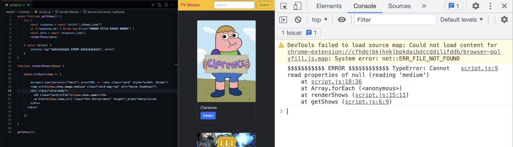

# TV Shows

## Demo
- [Netlify](https://tv-shows-hakan.netlify.app)


## Description
A web page that lists 77 TV Shows fetched from a .json file

## Goal
To get a better grasp of: 
- How to work with API's
- Async functions, and await keyword
- Fetch functions
- Promise
- How to use try-catch block in order to handle errors
- How to use "optional chaining"

## Challenge
Handling inconsistent data, i.e. different structures in different objects, and null values
1. First problem: Some TV show object's "image" key is directly in the top level of that specific object however for some TV shows it is encapsulated in "show" key

  - Figure that shows the error:
    - 

- Solution: Using optional chaining, making sure if the object accessed is `undefined` or `null`, the expression will be evaluated to `undefined`

Original code which yields error:
```javascript
src=`${show.image.medium}`
```
Code with optional chaining:
```javascript
src=`src=${show.image?.medium || show.show?.image?.medium`
```
2. Second problem: One of the 77 objects does have a "image" value of `null`

- Solution: Adding a placeholder image for those who do not have one

Original code which yields error:
```javascript
src=`src=${show.image?.medium || show.show?.image?.medium`
```
Code with workaround:
```javascript
src=`src=${show.image?.medium || show.show?.image?.medium || 'placeholder image url'`
```

##### E N D

```c

int main(void) 
{
    printf("Thanks for visiting this page.")
}
```

